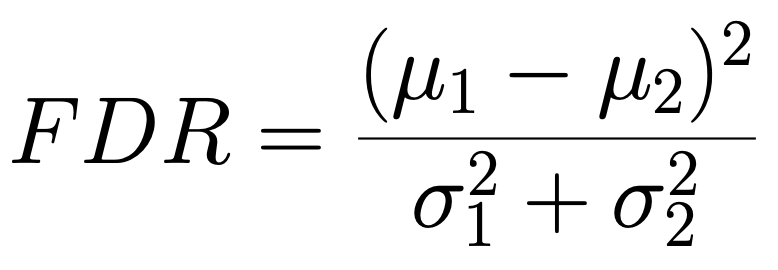
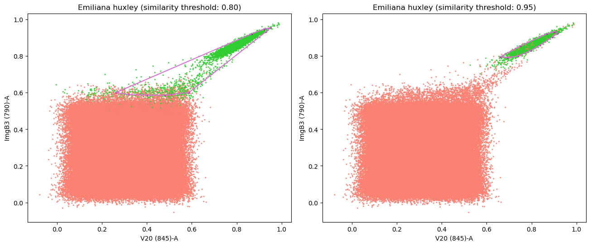

<p align="center">
  <a href="https://ai4life.eurobioimaging.eu/open-calls/">
    
  </a>
</p>

`Code: [](https://doi.org/10.5281/zenodo.15912249)`  
`Data: [](https://doi.org/10.5281/zenodo.12206170)`


# Project #10: Image-guided gating strategy for image-enabled cell sorting of phytoplankton
---

In this project, **Moritz Winker** from the European Molecular Biology Laboratory (EMBL) in Heidelberg is using a cutting-edge commercial flow cytometer to sort phytoplankton from lab-grown cultures or field samples. Sorting is traditionally done by selecting features measured by the instrument on the sample and manually drawing a gate defining the range of values in these features that correspond to the cells being selected.  
However, this new instrument is image-enabled and allows exporting not only traditional features but features derived from fluorescent images as well. In addition, it supports the import of gating strategies to the control software. This opens the door to automated analysis of the features and consequently, the generation of a gating strategy that can be uploaded directly to the flow cytometer.  

>"This is at the moment done manually and depends largely on the experience of the user."

The main challenge in this project was the limitations imposed by the device. The final output should be a device-compatible gating strategy. Therefore, just training a classifier couldn't be enough. Also, we can only use the channels that are measured by the device, not any other computed features. Another limitation was about the gates: each gate can be generated based on only two channels at max, and we can have a maximum of 14 gates.  

## Installation
It is highly recommended to use a python environment manager like [**conda**](https://docs.anaconda.com/free/miniconda/miniconda-install/) to create a clean environment for the installation.
You can install all the requirements by one command using provided environment config file (env.yml):
```bash
conda env create -f ./env.yml
```

### Requirements
- `python >= 3.9`
- `numpy`
- `matplotlib`
- `pytables`
- `pandas`
- `scipy == 1.11`
- `scikit-learn`
- `flowkit`
- `jupyterlab`
- `ipywidgets`
- `ipydatagrid`
- `tqdm`

After installing the requirements, clone the repository and run the `jupyter lab` command:
```bash
git clone https://github.com/ai4life-opencalls/oc_1_project_10.git
cd oc_1_project_10
jupyter lab
```

## Data
You can download a provided dataset from [here](https://zenodo.org/records/12206170).  


## Pipeline Usage
The whole pipline divided into the three steps:  
1. Transforming raw data into the *Logicle* scale
2. Finding the best channel pairs
3. Creating the gating strategy and save the workspace

In the `pipeline` directory, you can find three notebooks (numbered by steps).
<br><br>


### 💡 Step One (Logicle Transform):
It is a common practice in flow cytometry that the data get transformed into *log* or *logicle* space as the first step. This transformation helps to have a better visualization of the data and a better separation between species.
The *`1_logicle_transform.ipynb`* notebook is provided to do the logicle transform over the data. In this notebook, you need to set the raw data directory which contains your *`fcs`* files, and the directory that you want to save the transformed data (A dialog will be opened to set the directories).  
After cleaning the data and eliminating the uninformative channels, for each channel in each sample, the logicle parameters will be calculated from channel data and then transformation is applied to the channel.
<br><br>

### 💡 Step Two (Selecting Channel Pairs):
In the second step, by running the *`2_channel_pair_selection.ipynb`* notebook, the best channel pairs for the selected species will be proposed.  
In this notebook, after setting the raw data and the transformed data directories, you need to select the target species for the analysis. Since running the test strategy for each possible pair to calculate the pair precision takes a huge amount of time, we need to use a method to score the channel pairs, and then select pairs with high scores.  
The *Fisher Discriminant Ratio (FDR)* will be calculated for each channel. The Fisher ratio is a separability measure, majorly has been used in Linear Discriminant Analysis (LDA).

  

Then for all possible pairs (88,410 for 421 channels), an average fisher will be calculated. To select top score pairs, first, we choose pairs with having fisher score above the average. In the second step, for each channel, we select pairs of that channel that have a Fisher score above the median. In this way, we usually end up with about 20,000 selected pairs (more or less).  
However, pairs with the highest fisher score are not necessarily the most accurate ones in a gating strategy. Therefore, to find out the final ranking, we need to run a single-gate strategy to calculate the precision score. This step might take a few hours, depending on the machine's CPU and RAM.  
#### Polygon Gates
The provided code will generate a *polygon gate* for each channel pair. To generate such a polygon, first, a Cosine similarity between all samples with the average of the live samples is calculated. 
Then, the user needs to set a **_threshold_** parameter over the similarity: *samples with similarity above this threshold will be counted as alive samples which need to be inside the polygon gate*.

  

The higher the threshold, the more pure samples will be filtered in although the quantity would be less.
Finally, the polygon will be extracted from the thresholded data using the 2D histogram and Convex Hull method.
<br><br>

### 💡 Step Three (Gating):
In the third notebook, `3_gating_workspace.ipynb`, after selecting the target species, a table of the best channel pairs sorted by their precision score will be presented. You need to select pairs for the gating strategy from that table. You can skip rows by using Ctrl/CMD + L-Click.  
Then you select all *`fcs`* files you want to test the strategy against. By running the rest of the notebook you will see the strategy results and the gate plots.  Also, a *FlowJo* workspace including the gating strategy will be saved in the `workspaces` directory.


 
<br><br>

### Notes:
- The first step will create a `config.json` file in the same directory of the notebooks to store the raw data and the transformed data directories. This config will be used for the second and the third steps, and the user will not be asked to set these directories again. If you want to run the second or third step on different directories, you need to delete the `config.json` file.

